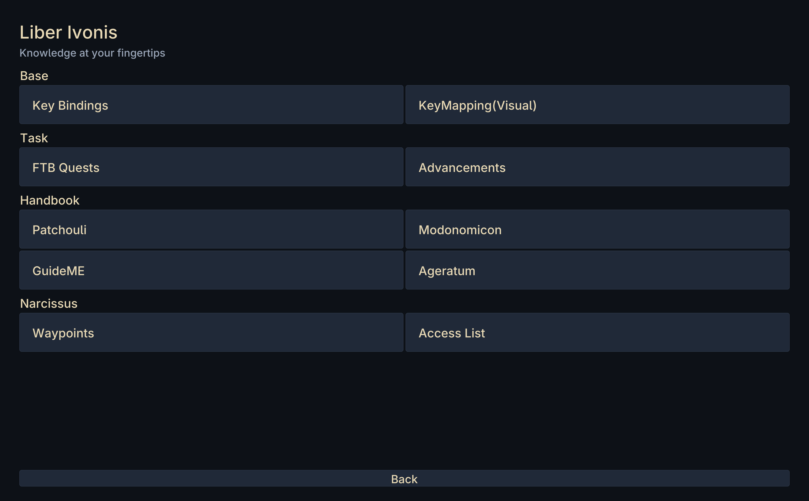

<div align="center">

# Liber Ivonis 伊波恩之书

*Minecraft Modpack Screen Hub*

</div>



## Introduction

In a modpack with massive mods, we need to bind many keys only to open a certain screen; Liber Ivonis is a mod that provides a screen hub to collect those screens.

[ModernUI](https://www.curseforge.com/minecraft/mc-mods/modern-ui) is required to run this mod.

## Feature

- A Screen Hub to collect screens 
- Open by Liber Ivonis item, Key or FTBLibrary buttom
- Integration of FTBQusets, Patchouli, Modonomicon, GuideME & Ageratum
- Support custom items & screens by a simple configuration
- Configurable color

## Configuration

Client：`config/liber_ivonis-client.toml`

```toml
[hub]
# Hub entries in display order
# Built-in: id|category
# Handbook: item:modid:item_id|title|category
# Screen: screen:class|method|title|category
# title & category support translation key, use `key:title.ageratum.guidebook`
# The params of method should be (Screen, Minecraft, ServerPlayer, Level) or no param
# The Return Type should be a sub-class of Screen
entries = [
    "controls|key:category.base", 
    "ftbquests|Task", # Also "screen:dev.ftb.mods.ftbquests.client.FTBQuestsClient|openGui|FTBQuests|Task"
    "patchouli|Handbook", 
    "modonomicon|Handbook", 
    "guideme|Handbook", 
    "ageratum|Handbook", 
    "advancement|Task", 
    "item:ageratum:guidebook|key:title.ageratum.guidebook|Handbook",
    "screen:com.github.einjerjar.mc.keymap.client.gui.screen.KeymapScreen|<init>|KeyMapping (Visual)|key:category.base", 
    "screen:xin.vanilla.narcissus.integration.ScreenHelper|openScreen|Waypoints|Narcissus", 
    "screen:xin.vanilla.narcissus.integration.ScreenHelper|openAccessListScreen|Access List|Narcissus"
]


[hub.colors]
# Hexadecimal colours in #AARRGGBB or #RRGGBB format. #RRGGBB is fully opaque.
background = "#FF0D1117"
surface = "#FF171D27"
surfaceAlt = "#FF202938"
accent = "#FFE8D9B5"
muted = "#FF9AA6B8"
outline = "#FF364255"
disabledOutline = "#FF252C38"
```

Common：`config/liber_ivonis-common.toml`

```toml
[gameplay]
giveBookOnStart = true
```
